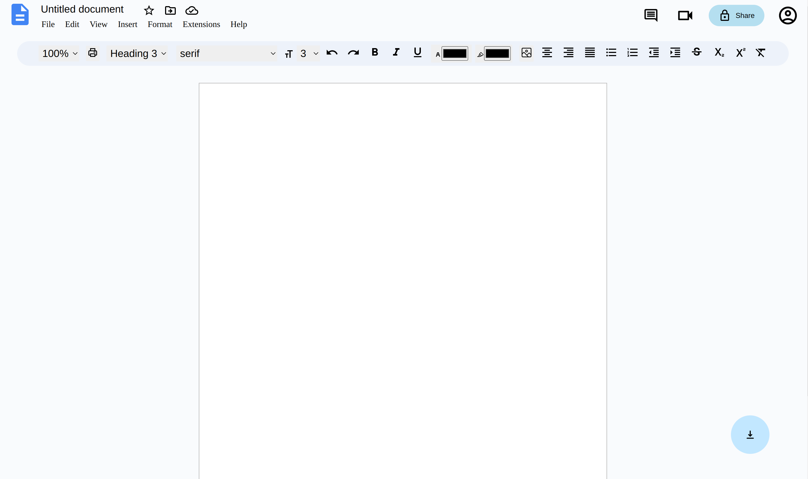
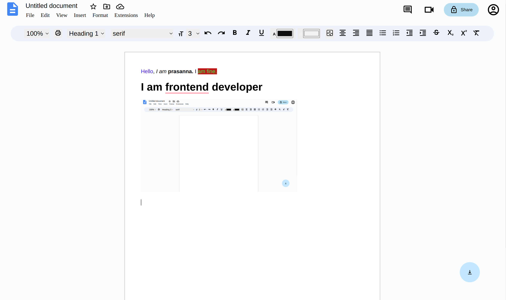

# Google docs

### Deployed Link : [Deployed link](https://project3-bay.vercel.app/)

### UI of google docs

### Formatting the text

* Created the ui of Google Doc as shown in image.
* This will include most of the things that we can do in google doc along with we will be able to download the edited doc .
* Implemented the functionalities of basic text formatting like bold, italic, underline, strikethrough, font size,font colour,font style,hihlight color and align the content.

* Tech stacks used:  
   * **HTML, CSS, JavaScript, React, MUI and Recoil for state management.**
